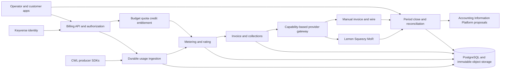

# Product and Technical Gap Baseline

**Status:** Proposed completion baseline  
**Assessment date:** 2026-08-21
**Assessed candidate:** PR [#82](https://github.com/ContextualWisdomLab/metering-billing-platform/pull/82), head `1356b3e148715a568f035608462f55e509374aa0`
**Default branch:** `develop`  
**Purpose:** Define the evidence required to move Metering Billing Platform from a contract-rich candidate stack to a releasable commercial product.

## Current working snapshot (2026-08-30)

The #87 work is stacked from implementation head
`c4bac13` on branch
`feat/late-adjustment-invoice-intent-20260830`; it incorporates the current
#173 application/rating guarantees while PR #173 remains the base review.
PR #173 remains open with no qualifying independent approval; mergeability and
local checks are not merge evidence. PR [#174](https://github.com/ContextualWisdomLab/metering-billing-platform/pull/174)
is the separate stacked review for the next immutable invoice-intent
composition slice; its initial implementation commit is
`5ef90218bf7660e0a4e6d29c8ee6ea0c87b42fa9`, with review-fix commit
`4201a55`; the implementation review-fix commits are
`1c0e824`, `32693becf9cbaf4a8d09b2e1c47ad639a5f64289`, and
`0d58ddcbeea2c3c2d3424346df12f6e9afab6325`, and
`837db28`, and
`bd06e17`, and
`dd1f18f759668f572fcda4849855ac2c82c07cf3`, followed by integration commit
`3c7c276da10366d124295937391e9de23e0cc9b3` and the import-cleanup fix
`c4bac13`.

The implemented #87 path now covers PostgreSQL migrations
`0048`/`0049`/`0050`/`0051`/`0053`/`0054`/`0055`/`0056`/`0057`/`0058`/`0059`/`0060`/`0061`/`0062`, the `LateAdjustment`,
application, rating-consumption, and invoice-adjustment contracts,
tenant-scoped presentment reads, and durable application/rating/composition
facts for late usage, correction, and reversal evidence. Composition now
captures the single billing account, rejects drafts already captured by
collection/journal/tax/credit downstream facts, blocks new downstream
collection/journal/tax/credit writes after composition under the shared draft
lock, and rejects amounts that would
round in issued-invoice storage. Issuance consumes linked compositions under
the draft lock as signed invoice lines, rejects zero or negative resulting
totals, rejects stale tax assessments pending reassessment, preserves large exact
totals before storage validation, and rejects a projected issued invoice above
10,000 lines. Direct composition persistence after downstream capture is blocked
by migration `0058`, enforces composition contract version 2 through migration
`0059`, `0060`, `0061`, `0062`, and historical v1 issued invoices remain readable through
the v2 presentment and issuance-replay envelopes; post-issue collection uses the
frozen adjusted total, direct issued persistence cannot omit linked lines, and
issued snapshots/lines cannot be mutated or rely on an implicit line type.
The source period
must be at least `soft_closed`; the target must be `open` and start no earlier
than the source end; composition requires a rated adjustment and an unissued
same-tenant, same-currency invoice draft. Targeted real-PostgreSQL, full
repository contract, and full 100% statement/branch coverage tests pass on the
working branch (782 tests, 19,388 statements, and 6,700 branches). Recalculation from source usage and rate-card versions,
provider settlement ingestion, FOCUS 1.4 export, tax/legal invoice treatment,
and statutory accounting remain open gaps.

## Executive decision

The candidate stack is a substantial **commercial-domain prototype and contract baseline**. It is **not yet a GA product**.

The strongest existing work is the explicit separation of usage, rating, commercial invoice intent, payment/collection facts, accounting proposals, provider projections, and tenant-scoped presentment. The implementation also has unusually strong local exact-decimal, idempotency, schema, documentation, and test discipline.

Completion is blocked by nine product-level gaps:

1. the implemented product is not on the default branch and the current release train still has multiple open, stacked candidates;
2. only the usage-ingestion vertical slice has a durable PostgreSQL runtime; the broader commercial runtime is still centered on the in-memory reference ledger;
3. published spend budgets do not authorize, reserve, commit, release, or deny work;
4. no live commerce adapter currently collects money or imports authoritative provider settlement evidence;
5. billing-period close, three-way reconciliation, FX, and standardized finance export are incomplete;
6. production identity, authorization, secrets, egress, compliance evidence, and release provenance are incomplete;
7. Storybook presentment is not an authenticated operator/customer application;
8. canonical SDKs and heterogeneous CWL producer integrations are not complete;
9. GA operability, performance, disaster recovery, release, and support evidence is not complete.

Until those conditions are satisfied, the accurate product statement is:

> Metering Billing Platform is a provider-neutral commercial-control-plane candidate with extensive immutable contracts and deterministic reference behavior. It is not yet a merged, provider-connected, durable, operated, or certified billing service.

## Assessment basis

This baseline examined:

- the `develop` branch;
- all open issues and pull requests visible on 2026-08-20;
- the current cumulative candidate tip in PR #82;
- current-head review and GitHub Actions state;
- `README.md`, `PRD.md`, `TRD.md`, `ARCHITECTURE.md`, `DATA_MODEL.md`, `SECURITY.md`, Storybook documentation, ADRs, schemas, migrations, implementation, and tests present on the candidate branch;
- the earlier provider-neutral billing design principles already reflected in the repository;
- current primary specifications for CloudEvents, FOCUS, OpenTelemetry, PCI DSS, SLSA, SPDX, and WCAG.

This is a repository and product-readiness assessment. It is not a legal, tax, accounting, PCI, SOC 2, or CSAP certification.

## Current repository evidence

> **Status update (2026-08-25):** the verified release train has merged. The
> cumulative candidate stack (`#82` plus descendants `#93`–`#132`, recreated
> as `#133`–`#136`) and the contributor/validation docs (`#137`) are on
> `develop`. Superseded snapshots (`#1`, `#3`, `#4`, `#92`–`#94`) are closed
> as absorbed. Issue `#83` (collapse superseded snapshot PRs into a verified
> release train) is complete: zero open pull requests remain, and the exact
> head was validated offline — 39 PostgreSQL migrations applied, full unit
> suite OK, 100% statement/branch coverage (16,971 statements, 5,870
> branches), repository contracts valid, compile clean. The gap backlog
> `#84`–`#91` is unchanged and now applies directly to the default branch.

### Default branch

As of the status update above, `develop` contains the complete candidate
product including durable PostgreSQL persistence for the commercial ledger,
spend-budget publication/evaluation/observation, journal-proposal
persistence, and operator-console Storybook presentment.

### Pull-request topology

At assessment time (2026-08-20):

- ordinary open issues before this assessment: **9** (`#83`–`#91`), all completion-gap issues;
- open pull requests: **5** (`#1`, `#3`, `#4`, `#82`, and draft `#92`);
- current cumulative tip: PR #82;
- PR #82 at the assessed head: **133 commits**, **437 changed files**, about **91.9k additions**;
- PR #82 targets `develop` directly.

The top PR is mergeable at the Git graph level, but that is not release evidence. At the assessed head `1356b3e148715a568f035608462f55e509374aa0`:

- Foundation CI, Security Scan, SAST Semgrep, and the required OpenCode/Noema/scheduler jobs: pending;
- independent approval: required and absent;
- unresolved review threads: none observed, but the only formal review was a commented automated security review.

PR #82 has 599 local Python tests, 100% statement/branch coverage for the declared Python scope including a dedicated PostgreSQL 18 integration database, a green repository validator, optimized-Python resolver checks, local Semgrep with zero findings, a real PostgreSQL 18 migration/constraint smoke run, an advisory-locking checksum/drift-detecting migration runner, and a hash-locked runtime dependency export. Those are useful candidate-branch claims, but hosted exact-head Checks and independent review must verify the head that merges.

### Candidate capabilities already present

The cumulative candidate provides meaningful foundations:

| Capability | Candidate evidence | Current limitation |
|---|---|---|
| Usage attribution | Tenant, billing account, principal, credential, project, cost center, product, meter, quality, immutable source hash | Real producer SDK/adoption and durable production ingestion remain incomplete |
| Metering and rating | Exact-decimal quantity/money, billability quality policy, versioned flat rate cards, half-open windows, replay-safe rating | Tiered/package/commitment pricing and full contract engine are incomplete |
| Invoice and collections | Draft/issue/void commercial invoices, credit notes, collections, dunning, disputes, write-offs, payments, unapplied cash, refunds, settlement facts | No live provider collection or legal invoice authority |
| Tax | Versioned static rate and deterministic draft assessment | Not a jurisdictional tax engine; exemptions, nexus, legal tax documents, MoR authority, and global compliance are incomplete |
| Accounting boundary | Balanced proposal-only journals and AIS posting-receipt observations | Correctly does not own statutory books; end-to-end released AIS integration still requires operational proof |
| Webhooks and API | Tenant-scoped HTTP adapter, HMAC webhook outbox, AIS outbox drain, local API credentials, bounded URL controls | Production identity, KMS, egress gateway, durable queue, and provider webhook normalization are incomplete |
| Presentment | Storybook components for many exact-decimal commercial statements | No production SPA, customer portal, login, workflow queue, or full accessibility evidence |
| Database design | PostgreSQL 18 migrations and normalized constraints exist; migrations `0036` and `0037` add tenant proposal-reference uniqueness, non-overlapping credential intervals, and durable tenant/credential URN identity; `PostgresUsageLedger` now runs durable catalog, usage, measurement, and receipt writes with atomic replay/conflict handling; CI applies the migration set through an advisory-locking, checksum/drift-detecting runner | The broader commercial services still use the in-memory reference ledger; rollback/recovery tests, raw-payload storage, backup/restore, and hot partitioning remain open |
| Quality policy | Extensive schemas, ADRs, docs, local 100% coverage claim, commit-pinned Actions | Candidate remains unmerged; exact-head hosted and release-artifact evidence is incomplete |
| Spend visibility | Rated-spend views by product/project/credential/principal/cost center and an append-only spend budget | Budget publication does not reserve, enforce, deny, or grant entitlement |

## Authority and product boundary

### This repository should own

- canonical commercial usage events and correction lineage;
- billing attribution from principal/credential/project/cost center to billing account;
- versioned meter, quality, price-book, rate-plan, contract, credit, quota, budget, and entitlement decisions;
- deterministic rating results and commercial invoice intent;
- provider-neutral payment, refund, dispute, settlement, and reconciliation facts;
- provider mappings and projections;
- commercial explainability and evidence links;
- proposal-only accounting exports to the Accounting Information Platform.

### This repository should not own

- Keyverse credentials, passkeys, external IdP federation, or SCIM source truth;
- card PAN/CVC or card-entry elements;
- statutory chart of accounts, posted journals, fiscal close, consolidation, or financial statements;
- unqualified legal tax advice, global tax calculation, or statutory invoice authority;
- raw customer prompts, model responses, document content, respondent responses, or unrelated PII;
- provider customer/subscription IDs as core primary keys;
- product-specific pricing logic embedded in every CWL producer.

## Completion backlog

The assessment produced the following issues. Their acceptance criteria constitute the minimum completion evidence for the corresponding gap.

| Priority | Issue | Completion outcome |
|---:|---|---|
| P0 | [#83 — Collapse the superseded snapshot PRs into a verified release train](https://github.com/ContextualWisdomLab/metering-billing-platform/issues/83) | Product baseline is merged, traceable, independently approved, and exact-head verified |
| P0 | [#84 — Replace the in-memory reference ledger with a durable PostgreSQL production path](https://github.com/ContextualWisdomLab/metering-billing-platform/issues/84) | Production commands survive restart, concurrency, failover, backup, restore, and hot partitions |
| P0 | [#85 — Enforce spend budgets with atomic authorization, quotas, and entitlements](https://github.com/ContextualWisdomLab/metering-billing-platform/issues/85) | Pre-execution reserve/commit/release control and effective-dated entitlements work safely |
| P0 | [#86 — Ship capability-based provider adapters and first production collection channels](https://github.com/ContextualWisdomLab/metering-billing-platform/issues/86) | Lemon Squeezy MoR plus manual invoice/wire collect money without owning the core ledger |
| P0 | [#87 — Implement period close, three-way reconciliation, FX, and FOCUS 1.4 export](https://github.com/ContextualWisdomLab/metering-billing-platform/issues/87) | Internal expectation, provider actual, and cash settlement reconcile for immutable periods |
| P0 | [#88 — Close production identity, secret, compliance, and supply-chain gaps](https://github.com/ContextualWisdomLab/metering-billing-platform/issues/88) | Keyverse-bound identity, purpose authorization, KMS, egress controls, compliance evidence, SBOM, and provenance exist |
| P1 | [#89 — Ship authenticated operator and customer billing applications with explainable billing](https://github.com/ContextualWisdomLab/metering-billing-platform/issues/89) | Buyers and operators can act safely and trace every charge to source evidence |
| P0 | [#90 — Publish canonical SDKs and onboard three heterogeneous CWL usage producers](https://github.com/ContextualWisdomLab/metering-billing-platform/issues/90) | AI, document, and scientific products emit the same durable commercial contract without duplicate billing logic |
| P0 | [#91 — Establish operability, performance, release, and support evidence](https://github.com/ContextualWisdomLab/metering-billing-platform/issues/91) | The product is installable, observable, recoverable, capacity-tested, signed, versioned, and supportable |

## Recommended delivery sequence

```text
M0  Release topology and integration
    #83

M1  Durable authority and security foundation
    #84 + #88

M2  Product control and ecosystem contracts
    #85 + #90

M3  Real commerce channels
    #86

M4  Period close and financial reconciliation
    #87

M5  Buyer/operator product surface
    #89

M6  GA evidence and release
    #91
```

Work can be stacked when public contracts are stable, but each PR must remain independently reviewable. A new cumulative mega-PR must not recreate the current integration problem.

## Open pull-request inventory

The current repository inventory on 2026-08-20 contains five open candidates:

| PR | Scope | Base | Current evidence |
|---:|---|---|---|
| #1 | Provider-neutral billing foundation | `develop` | Checks pending; no formal approval |
| #3 | Operator README, ADR, APA references, and validation documentation | PR #1 | Draft; repository contracts pending |
| #4 | Buyer/operator README and contributor documentation | `develop` | Historical Checks passed; no formal approval |
| #82 | Cumulative commercial lifecycle and spend-budget publication with security hardening | `develop` | Head `59051d4`; review required; required Checks pending |
| #92 | This product and technical gap baseline | PR #82 | Draft; repository contracts pending |

PRs #5–#81 are closed as superseded snapshots. Their closure is not merge or
production evidence. PR #92 is the current detailed baseline candidate and
must remain synchronized with the open-PR list, issue backlog, exact heads,
review decisions, and hosted Checks. The GitHub records are authoritative for
live status; this table is the reviewable product snapshot.

## Target commercial vertical

The first sellable end-to-end path should be:

```text
contextual-orchestrator / document processor / scientific engine
→ canonical CloudEvents-compatible usage event
→ durable attribution and deduplication
→ spend authorization reserve
→ operation executes
→ actual usage commit and unused reservation release
→ meter quality and deterministic rating
→ invoice intent and entitlement update
→ Lemon Squeezy MoR or manual enterprise invoice projection
→ payment / refund / dispute / settlement facts
→ three-way reconciliation and period close
→ proposal-only AIS journal export
→ customer/operator explainability and FOCUS export
```

This path is complete only when a single invoice line can be traversed in both directions:

```text
invoice line
↔ rating result and formula/version
↔ usage aggregate and immutable events
↔ product/project/principal/credential attribution
↔ spend authorization and entitlement
↔ provider invoice/payment/settlement evidence
↔ reconciliation result
↔ accounting proposal and AIS observation
```

## Target architecture



Start as a modular monolith with explicit ports. Split ingestion, provider workers, or reconciliation only when measured throughput, availability, or PCI/network trust boundaries justify independent deployment.

## Database and event requirements

- PostgreSQL is the exercised production system of record; the memory ledger remains a reference/test adapter.
- All database objects use two-or-more-word `snake_case` and satisfy third normal form.
- Tenant isolation is enforced in the database and API; cross-tenant references are impossible or fail closed.
- High-volume usage, inbox, outbox, audit, and rating tables have a measured anti-hot-partition strategy.
- Money and billable quantities use exact decimals with explicit currency/unit semantics.
- Commercial corrections, reversals, mappings, rate versions, contracts, and closed-period facts are append-only/effective-dated.
- Commands and outbox facts commit atomically.
- Raw usage/provider claims are immutable encrypted artifacts with hashes and retention references, not the normalized domain model.
- At-least-once delivery yields at-most-once monetary effects.
- CloudEvents `source + id` uniqueness and tenant-scoped `source_event_key` have explicit, tested roles.
- OpenTelemetry telemetry may correlate operations but is not sampled billing truth.

## Security and compliance requirements

- Production identity is anchored in Keyverse or an equivalent signed workload/human identity plane.
- The tenant-pin bootstrap behavior is not a normal production authentication path and cannot reopen automatically.
- Legitimately required billing PII remains usable through purpose-bound, field-authorized access, encryption, audit, and retention rather than blanket masking.
- Card-entry elements remain provider-hosted; CWL does not receive or store PAN/CVC.
- Provider/webhook secrets, signing keys, credential peppers, and remittance secrets use KMS/secret storage and rotation.
- Outbound requests enforce scheme/host/port/method, DNS rebinding resistance, redirect policy, private-address denial, TLS, size, timeout, and retry budgets.
- PCI DSS v4.0.1, SOC 2, and CSAP artifacts are evidence mappings until an actual assessment/certification exists.
- Every release has SPDX 3.0.1 SBOM, SLSA 1.2 provenance, signatures, immutable dependency/action pins, and verification receipts.

## Product experience requirements

- Storybook remains the component contract; production operator/customer applications consume the same components and design tokens.
- A Figma File ID is recorded in an ADR before UI implementation is called complete.
- Usage, spend, budget/credit, invoices, contract/entitlement, payment/provider documents, reconciliation, and audit are actionable workflows.
- Every customer-facing state states the next action.
- Charts have exact-value tables and accessible keyboard/screen-reader alternatives.
- Korean and English are the first supported locales, with complete message-key and semantic-consistency tests.
- UI and exports preserve exact decimals, currency, signs, timezone, provenance, and units in screen, CSV/JSON, SVG, print, and PDF.

## Commercial definition of done

A GA claim requires all of the following evidence on the released exact head:

### Repository and review

- default branch contains the complete product;
- no valid capability remains only on a superseded PR branch;
- all required Checks are terminal successful on the exact released head;
- independent approval and zero unresolved review threads;
- no branch-protection bypass or self-approval.

### Correctness

- production statement coverage: 100%;
- production branch coverage: 100%;
- public API/docstring coverage: 100%;
- frontend interaction, design-token, i18n, accessibility, and action-edge tests meet the same completeness policy;
- exact-decimal, idempotency, replay, correction, concurrency, tenant-isolation, provider, close, reconciliation, and ledger invariants pass property/golden tests;
- reality-based tests include retries, late/out-of-order events, partial payments, overpayments, refunds, disputes, chargebacks, provider fees, FX, hard-close adjustments, workload cancellation, and credential rotation.

### Operations

- supported Compose/production deployment profiles;
- liveness/readiness, graceful drain, backpressure, lease, and restart recovery;
- measured SLOs, error budgets, capacity envelope, load/soak/fault tests;
- backup, point-in-time restore, disaster recovery, and tenant export/offboarding rehearsals;
- executable incident and finance-operation runbooks with owners and evidence.

### Release

- semantic version, changelog, compatibility policy, migration and rollback guide, support matrix, and known limitations;
- deterministic OpenAPI/AsyncAPI/JSON Schema and Rust/TypeScript/Python SDK artifacts;
- signed package/container artifacts, SPDX 3.0.1 SBOM, SLSA 1.2 provenance, and reproducibility/verification evidence;
- no unsupported claim of tax, statutory-invoice, PCI, SOC 2, CSAP, availability, performance, or legal compliance.

## Explicit current non-claims

At the assessed head, do **not** describe the product as:

- merged or releasable from `develop`;
- a durable production PostgreSQL billing service;
- a real-time budget-enforcement or entitlement engine;
- connected to a production payment/MoR/PG channel;
- a global tax engine or statutory invoice service;
- a reconciled financial-close system;
- an authenticated production operator/customer web application;
- PCI DSS, SOC 2, or CSAP certified;
- a signed, versioned, supported GA release.

## Standards traceability

| Standard/specification | Product use | Boundary |
|---|---|---|
| CloudEvents 1.0.2 | Canonical service-event envelope and interoperable producer transport | Does not define billing semantics, price, or idempotency policy by itself |
| FOCUS 1.4 | Cost/usage, Invoice Detail, Billing Period, and Contract Commitment export/reconciliation | Export/analytics contract, not the internal normalized ledger |
| OpenTelemetry Specification 1.59.0 and Semantic Conventions 1.44.0 | Operational traces, metrics, logs, and GenAI naming alignment | Sampled telemetry is not commercial source truth; sensitive content is excluded |
| PCI DSS 4.0.1 | Card-data scope, hosted payment surface, security evidence | Implementation does not equal certification; CWL should avoid receiving PAN/CVC |
| SLSA 1.2 | Source/build provenance and supply-chain assurance | Requires generated and verified attestations for actual release artifacts |
| SPDX 3.0.1 | SBOM, package, build, license, vulnerability, provenance exchange | SBOM generation must reflect the released artifact, not only source dependencies |
| WCAG 2.2 | Operator/customer application and exact-value visualization accessibility | Requires tested user journeys, not only component declarations |

## Doctoring references — APA 7th

Cloud Native Computing Foundation. (2022). *CloudEvents specification* (Version 1.0.2). https://github.com/cloudevents/spec

FinOps Foundation. (2026). *FinOps Open Cost and Usage Specification* (Version 1.4). https://focus.finops.org/focus-specification/

Lemon Squeezy. (n.d.). *Usage-based billing*. https://docs.lemonsqueezy.com/help/products/usage-based-billing

OpenTelemetry Authors. (n.d.). *OpenTelemetry specifications*. https://opentelemetry.io/docs/specs/

PCI Security Standards Council. (2024). *Payment Card Industry Data Security Standard: Requirements and testing procedures* (Version 4.0.1). https://www.pcisecuritystandards.org/

SLSA Community. (2025). *SLSA specification* (Version 1.2). https://slsa.dev/spec/v1.2/

SPDX Workgroup. (2024). *SPDX specification* (Version 3.0.1). https://spdx.github.io/spdx-spec/

World Wide Web Consortium. (2023). *Web Content Accessibility Guidelines (WCAG) 2.2*. https://www.w3.org/TR/WCAG22/

## Maintenance rule

Update this file whenever any of the following changes:

- an issue in #83–#91 is completed, split, superseded, or rejected;
- the canonical integration PR/head changes;
- a new provider, producer, pricing method, deployment profile, compliance scope, or release target is adopted;
- evidence invalidates a current gap or reveals a new buyer-visible gap;
- the product reaches a release candidate or GA decision.

A completed checkbox must point to merged code, exact-head tests, and operational/release evidence. Documentation or a queued workflow alone does not close a gap.
