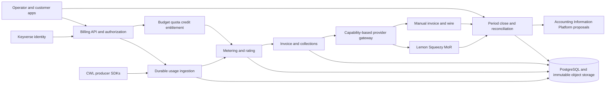

# Product and Technical Gap Baseline

**Status:** Active current-state gap baseline
**Assessment date:** 2026-08-28
**Assessed head:** `develop` at `d514e9a29ff33531b9df3d231cd3b4ff02bcc274` (PR [#141](https://github.com/ContextualWisdomLab/metering-billing-platform/pull/141))
**Default branch:** `develop`  
**Purpose:** Define the evidence required to move Metering Billing Platform from a contract-rich candidate stack to a releasable commercial product.

## Executive decision

The candidate stack is a substantial **commercial-domain prototype and contract baseline**. It is **not yet a GA product**.

The strongest existing work is the explicit separation of usage, rating, commercial invoice intent, payment/collection facts, accounting proposals, provider projections, and tenant-scoped presentment. The implementation also has unusually strong local exact-decimal, idempotency, schema, documentation, and test discipline.

Completion is blocked by eight product-level gaps. Release integration #83 is complete and is retained below as historical evidence:

1. PostgreSQL adapters and a Compose API deployment exist, but restart/concurrency, database isolation, raw evidence, partitioning, backup/restore, and worker recovery evidence required for a complete production path are incomplete;
2. published spend budgets do not authorize, reserve, commit, release, or deny work;
3. no live commerce adapter currently collects money or imports authoritative provider settlement evidence;
4. billing-period close, three-way reconciliation, FX, and standardized finance export are incomplete;
5. production identity, authorization, secrets, egress, compliance evidence, and release provenance are incomplete;
6. Storybook presentment is not an authenticated operator/customer application;
7. the canonical Python producer reference and a durable outbox slice are open in stacked PRs, but canonical SDK coverage and heterogeneous CWL producer integrations are not complete;
8. GA operability, performance, disaster recovery, release, and support evidence is not complete.

Until those conditions are satisfied, the accurate product statement is:

> Metering Billing Platform is a merged provider-neutral commercial-control-plane candidate with extensive immutable contracts, a durable PostgreSQL adapter, and a reproducible Compose surface. It is not yet a provider-connected, fully operated, reconciled, or certified GA billing service.

## Assessment basis

This baseline examined:

- the `develop` branch;
- all open issues and pull requests visible on 2026-08-28;
- the exact `develop` head after the PR #141 merge;
- current-head review and GitHub Actions state;
- `README.md`, `PRD.md`, `TRD.md`, `ARCHITECTURE.md`, `DATA_MODEL.md`, `SECURITY.md`, Storybook documentation, ADRs, schemas, migrations, implementation, and tests present on the candidate branch;
- the earlier provider-neutral billing design principles already reflected in the repository;
- current primary specifications for CloudEvents, FOCUS, OpenTelemetry, PCI DSS, SLSA, SPDX, and WCAG.

This is a repository and product-readiness assessment. It is not a legal, tax, accounting, PCI, SOC 2, or CSAP certification.

## Current repository evidence

> **Status update (2026-08-28):** GitHub reports eight open pull requests
> (`#142`–`#149`). PRs `#142`–`#146` target `develop`; PR `#147` and #148 are stacked on
> the canonical producer SDK branch from PR `#146`, and #149 is stacked on #148.
> The current default branch is
> `develop` at `d514e9a29ff33531b9df3d231cd3b4ff02bcc274`, merged from PR #141
> on 2026-08-26. The merged release train and the Compose, threaded API,
> durable credential, and k6 baseline work are on `develop`. Issue #83 is
> closed; the remaining open gap backlog is #84–#91. At this assessment,
> PRs `#142`–`#146` are `BLOCKED`/`REVIEW_REQUIRED`; PR `#147` and #148 are
> `CLEAN` on their stacked bases, while #149 is pending Checks. None is merge
> evidence for `develop`.

### Default branch

`develop` contains the merged candidate product including PostgreSQL adapters
for the normalized commercial records, environment-selected durable API
startup, spend-budget publication/evaluation/observation, journal-proposal
persistence, and operator-console Storybook presentment. `MemoryUsageLedger`
remains the deterministic reference/test adapter. The production-path
acceptance evidence in #84 is still incomplete: the repository does not yet
prove the full restart, isolation, raw-evidence, recovery, and high-volume
operational contract.

### Pull-request topology

As queried from GitHub on 2026-08-28:

- open issues: **8** (`#84`–`#91`);
- open pull requests: **8** (`#142`–`#149`); `#142`–`#146` target `develop`, `#147` and `#148` target the branch of `#146`, and `#149` targets the branch of `#148`;
- stacked producer work: `#146` provides the canonical Python producer reference, `#147` adds the durable producer outbox slice, `#148` adds the Rust reference, and `#149` adds the TypeScript reference;
- latest default-branch merge: PR #141 at `d514e9a29ff33531b9df3d231cd3b4ff02bcc274`;
- the merged PR #141 rollup included a failed `Semgrep (multi-language SAST)` job alongside successful repository, analysis, dependency, coverage, and other checks; therefore the merge is not a blanket claim that every release/security gate is complete.

The current head has useful implementation and hosted-check evidence, but the
remaining issue acceptance criteria require additional exact-head integration,
security, recovery, provider, frontend, and operational evidence.

### Candidate capabilities already present

The cumulative candidate provides meaningful foundations:

| Capability | Candidate evidence | Current limitation |
|---|---|---|
| Usage attribution | Tenant, billing account, principal, credential, project, cost center, product, meter, quality, immutable source hash; canonical Python builder and durable producer outbox slices are present in open PRs | Real producer SDK adoption, heterogeneous integrations, and durable production ingestion remain incomplete |
| Metering and rating | Exact-decimal quantity/money, billability quality policy, versioned flat rate cards, half-open windows, replay-safe rating | Tiered/package/commitment pricing and full contract engine are incomplete |
| Invoice and collections | Draft/issue/void commercial invoices, credit notes, collections, dunning, disputes, write-offs, payments, unapplied cash, refunds, settlement facts | No live provider collection or legal invoice authority |
| Tax | Versioned static rate and deterministic draft assessment | Not a jurisdictional tax engine; exemptions, nexus, legal tax documents, MoR authority, and global compliance are incomplete |
| Accounting boundary | Balanced proposal-only journals and AIS posting-receipt observations | Correctly does not own statutory books; end-to-end released AIS integration still requires operational proof |
| Webhooks and API | Tenant-scoped HTTP adapter, HMAC webhook outbox, AIS outbox drain, local API credentials, bounded URL controls | Production identity, KMS, egress gateway, durable queue, and provider webhook normalization are incomplete |
| Presentment | Storybook components for many exact-decimal commercial statements | No production SPA, customer portal, login, workflow queue, or full accessibility evidence |
| Database design | PostgreSQL 18 migrations and normalized constraints exist; migrations `0036` and `0037` add tenant proposal-reference uniqueness, non-overlapping credential intervals, and durable tenant/credential URN identity; `PostgresUsageLedger` has durable catalog, usage, measurement, rating, invoice, collection, payment, credit, budget, journal, and receipt paths with atomic replay/conflict handling; CI applies migrations through an advisory-locking, checksum/drift-detecting runner | Full restart/concurrency/isolation evidence, immutable object storage, backup/restore, failed-migration recovery, worker leases, and measured hot-partition behavior remain open |
| Quality policy | Extensive schemas, ADRs, docs, merged default-branch implementation, and commit-pinned Actions | Current head has only the observed push Checks above; complete GA exact-head and release-artifact evidence remains open |
| Spend visibility | Rated-spend views by product/project/credential/principal/cost center and an append-only spend budget | Budget publication does not reserve, enforce, deny, or grant entitlement |

## Authority and product boundary

### This repository should own

- canonical commercial usage events and correction lineage;
- billing attribution from principal/credential/project/cost center to billing account;
- versioned meter, quality, price-book, rate-plan, contract, credit, quota, budget, and entitlement decisions;
- deterministic rating results and commercial invoice intent;
- provider-neutral payment, refund, dispute, settlement, and reconciliation facts;
- provider mappings and projections;
- commercial explainability and evidence links;
- proposal-only accounting exports to the Accounting Information Platform.

### This repository should not own

- Keyverse credentials, passkeys, external IdP federation, or SCIM source truth;
- card PAN/CVC or card-entry elements;
- statutory chart of accounts, posted journals, fiscal close, consolidation, or financial statements;
- unqualified legal tax advice, global tax calculation, or statutory invoice authority;
- raw customer prompts, model responses, document content, respondent responses, or unrelated PII;
- provider customer/subscription IDs as core primary keys;
- product-specific pricing logic embedded in every CWL producer.

## Completion backlog

The assessment produced the following issues. Their acceptance criteria constitute the minimum completion evidence for the corresponding gap.

| Priority | Issue | Completion outcome |
|---:|---|---|
| P0 | [#83 — Collapse the superseded snapshot PRs into a verified release train](https://github.com/ContextualWisdomLab/metering-billing-platform/issues/83) | **Complete:** merged release train on `develop`; remaining capability gaps are tracked below |
| P0 | [#84 — Replace the in-memory reference ledger with a durable PostgreSQL production path](https://github.com/ContextualWisdomLab/metering-billing-platform/issues/84) | Production commands survive restart, concurrency, failover, backup, restore, and hot partitions |
| P0 | [#85 — Enforce spend budgets with atomic authorization, quotas, and entitlements](https://github.com/ContextualWisdomLab/metering-billing-platform/issues/85) | Pre-execution reserve/commit/release control and effective-dated entitlements work safely |
| P0 | [#86 — Ship capability-based provider adapters and first production collection channels](https://github.com/ContextualWisdomLab/metering-billing-platform/issues/86) | Lemon Squeezy MoR plus manual invoice/wire collect money without owning the core ledger |
| P0 | [#87 — Implement period close, three-way reconciliation, FX, and FOCUS 1.4 export](https://github.com/ContextualWisdomLab/metering-billing-platform/issues/87) | Internal expectation, provider actual, and cash settlement reconcile for immutable periods |
| P0 | [#88 — Close production identity, secret, compliance, and supply-chain gaps](https://github.com/ContextualWisdomLab/metering-billing-platform/issues/88) | Keyverse-bound identity, purpose authorization, KMS, egress controls, compliance evidence, SBOM, and provenance exist |
| P1 | [#89 — Ship authenticated operator and customer billing applications with explainable billing](https://github.com/ContextualWisdomLab/metering-billing-platform/issues/89) | Buyers and operators can act safely and trace every charge to source evidence |
| P0 | [#90 — Publish canonical SDKs and onboard three heterogeneous CWL usage producers](https://github.com/ContextualWisdomLab/metering-billing-platform/issues/90) | AI, document, and scientific products emit the same durable commercial contract without duplicate billing logic |
| P0 | [#91 — Establish operability, performance, release, and support evidence](https://github.com/ContextualWisdomLab/metering-billing-platform/issues/91) | The product is installable, observable, recoverable, capacity-tested, signed, versioned, and supportable |

## Recommended delivery sequence

```text
M0  Release topology and integration
    #83 (complete)

M1  Durable authority and security foundation
    #84 + #88

M2  Product control and ecosystem contracts
    #85 + #90

M3  Real commerce channels
    #86

M4  Period close and financial reconciliation
    #87

M5  Buyer/operator product surface
    #89

M6  GA evidence and release
    #91
```

Work can be stacked when public contracts are stable, but each PR must remain independently reviewable. A new cumulative mega-PR must not recreate the current integration problem.

## Current pull-request inventory

GitHub reports **eight open pull requests** on 2026-08-28. The latest merged
change is PR #141; the following open PR heads are current snapshots and are
not merge evidence:

| PR | Scope | Base | Current-head gate evidence |
|---:|---|---|---|
| #141 | Compose deployment, threaded web tier, durable credentials, and measured k6 baseline for #84 | `develop` | merged 2026-08-26 at `d514e9a29ff33531b9df3d231cd3b4ff02bcc274` |
| #142 | Product-gap baseline refresh and duplicate migration-table cleanup | `develop` | this document update; open, blocked, review required, zero unresolved threads, zero approvals; hosted Checks re-run after the current topology update |
| #143 | Durable spend-authorization lifecycle | `develop` | `a8f4ad630f6e21ef21dc25a20271850021b36796`; open, blocked, review required, zero unresolved threads, zero approvals |
| #144 | Webhook redirect hardening | `develop` | `1808e723f72b7335a0f82d7dd923c31c04280793`; open, blocked, review required, zero unresolved threads, zero approvals |
| #145 | Default configured HTTP ledger to PostgreSQL | `develop` | `2eb77788eb2aa4043e46678a5f7dad3081d91c4d`; open, blocked, review required, zero unresolved threads, zero approvals |
| #146 | Canonical Python producer SDK reference and CloudEvents conformance vector for #90 | `develop` | `29b37d73f4a7ae25784d3102aa24d9dd50c7b660`; open, blocked, review required, zero unresolved threads, zero approvals; OpenCode/Strix current-head evidence is unavailable because their providers failed |
| #147 | Durable producer outbox and retry/dead-letter boundary for #90 | `feat/canonical-producer-sdk-20260828` (stacked on #146) | `88240fd2cd1c0189db460d949611203e4bcb2773`; open, clean, dependent on #146; all current Checks pass; current GitHub HEAD and Checks remain authoritative |
| #148 | Canonical Rust producer SDK reference for #90 | `feat/canonical-producer-sdk-20260828` (stacked on #146) | `92cb8e46349b986aa869366ccb35b817fb6f8d6b`; open, clean, dependent on #146; current Checks pass; current GitHub HEAD and Checks remain authoritative |
| #149 | Canonical TypeScript producer SDK reference for #90 | `feat/canonical-rust-sdk-20260828` (stacked on #148) | `13a6a099db8a46869e870fff8c9765407796c6a1`; open, checks pending, dependent on #148/#146; current GitHub HEAD and Checks remain authoritative |

Earlier PRs are closed or superseded. Their closure is not proof that the
remaining #84–#91 acceptance criteria are complete. GitHub records remain
authoritative for live status; this section is the current reviewable snapshot.

## Target commercial vertical

The first sellable end-to-end path should be:

```text
contextual-orchestrator / document processor / scientific engine
→ canonical CloudEvents-compatible usage event
→ durable attribution and deduplication
→ spend authorization reserve
→ operation executes
→ actual usage commit and unused reservation release
→ meter quality and deterministic rating
→ invoice intent and entitlement update
→ Lemon Squeezy MoR or manual enterprise invoice projection
→ payment / refund / dispute / settlement facts
→ three-way reconciliation and period close
→ proposal-only AIS journal export
→ customer/operator explainability and FOCUS export
```

This path is complete only when a single invoice line can be traversed in both directions:

```text
invoice line
↔ rating result and formula/version
↔ usage aggregate and immutable events
↔ product/project/principal/credential attribution
↔ spend authorization and entitlement
↔ provider invoice/payment/settlement evidence
↔ reconciliation result
↔ accounting proposal and AIS observation
```

## Target architecture



Start as a modular monolith with explicit ports. Split ingestion, provider workers, or reconciliation only when measured throughput, availability, or PCI/network trust boundaries justify independent deployment.

## Database and event requirements

- PostgreSQL is the exercised production system of record; the memory ledger remains a reference/test adapter.
- All database objects use two-or-more-word `snake_case` and satisfy third normal form.
- Tenant isolation is enforced in the database and API; cross-tenant references are impossible or fail closed.
- High-volume usage, inbox, outbox, audit, and rating tables have a measured anti-hot-partition strategy.
- Money and billable quantities use exact decimals with explicit currency/unit semantics.
- Commercial corrections, reversals, mappings, rate versions, contracts, and closed-period facts are append-only/effective-dated.
- Commands and outbox facts commit atomically.
- Raw usage/provider claims are immutable encrypted artifacts with hashes and retention references, not the normalized domain model.
- At-least-once delivery yields at-most-once monetary effects.
- CloudEvents `source + id` uniqueness and tenant-scoped `source_event_key` have explicit, tested roles.
- OpenTelemetry telemetry may correlate operations but is not sampled billing truth.

## Security and compliance requirements

- Production identity is anchored in Keyverse or an equivalent signed workload/human identity plane.
- The tenant-pin bootstrap behavior is not a normal production authentication path and cannot reopen automatically.
- Legitimately required billing PII remains usable through purpose-bound, field-authorized access, encryption, audit, and retention rather than blanket masking.
- Card-entry elements remain provider-hosted; CWL does not receive or store PAN/CVC.
- Provider/webhook secrets, signing keys, credential peppers, and remittance secrets use KMS/secret storage and rotation.
- Outbound requests enforce scheme/host/port/method, DNS rebinding resistance, redirect policy, private-address denial, TLS, size, timeout, and retry budgets.
- PCI DSS v4.0.1, SOC 2, and CSAP artifacts are evidence mappings until an actual assessment/certification exists.
- Every release has SPDX 3.0.1 SBOM, SLSA 1.2 provenance, signatures, immutable dependency/action pins, and verification receipts.

## Product experience requirements

- Storybook remains the component contract; production operator/customer applications consume the same components and design tokens.
- A Figma File ID is recorded in an ADR before UI implementation is called complete.
- Usage, spend, budget/credit, invoices, contract/entitlement, payment/provider documents, reconciliation, and audit are actionable workflows.
- Every customer-facing state states the next action.
- Charts have exact-value tables and accessible keyboard/screen-reader alternatives.
- Korean and English are the first supported locales, with complete message-key and semantic-consistency tests.
- UI and exports preserve exact decimals, currency, signs, timezone, provenance, and units in screen, CSV/JSON, SVG, print, and PDF.

## Commercial definition of done

A GA claim requires all of the following evidence on the released exact head:

### Repository and review

- default branch contains the complete product;
- no valid capability remains only on a superseded PR branch;
- all required Checks are terminal successful on the exact released head;
- independent approval and zero unresolved review threads;
- no branch-protection bypass or self-approval.

### Correctness

- production statement coverage: 100%;
- production branch coverage: 100%;
- public API/docstring coverage: 100%;
- frontend interaction, design-token, i18n, accessibility, and action-edge tests meet the same completeness policy;
- exact-decimal, idempotency, replay, correction, concurrency, tenant-isolation, provider, close, reconciliation, and ledger invariants pass property/golden tests;
- reality-based tests include retries, late/out-of-order events, partial payments, overpayments, refunds, disputes, chargebacks, provider fees, FX, hard-close adjustments, workload cancellation, and credential rotation.

### Operations

- supported Compose/production deployment profiles;
- liveness/readiness, graceful drain, backpressure, lease, and restart recovery;
- measured SLOs, error budgets, capacity envelope, load/soak/fault tests;
- backup, point-in-time restore, disaster recovery, and tenant export/offboarding rehearsals;
- executable incident and finance-operation runbooks with owners and evidence.

### Release

- semantic version, changelog, compatibility policy, migration and rollback guide, support matrix, and known limitations;
- deterministic OpenAPI/AsyncAPI/JSON Schema and Rust/TypeScript/Python SDK artifacts;
- signed package/container artifacts, SPDX 3.0.1 SBOM, SLSA 1.2 provenance, and reproducibility/verification evidence;
- no unsupported claim of tax, statutory-invoice, PCI, SOC 2, CSAP, availability, performance, or legal compliance.

## Explicit current non-claims

At the assessed head, do **not** describe the product as:

- a complete GA release from `develop`;
- a fully evidenced durable production PostgreSQL billing service;
- a real-time budget-enforcement or entitlement engine;
- connected to a production payment/MoR/PG channel;
- a global tax engine or statutory invoice service;
- a reconciled financial-close system;
- an authenticated production operator/customer web application;
- PCI DSS, SOC 2, or CSAP certified;
- a signed, versioned, supported GA release.

## Standards traceability

| Standard/specification | Product use | Boundary |
|---|---|---|
| CloudEvents 1.0.2 | Canonical service-event envelope and interoperable producer transport | Does not define billing semantics, price, or idempotency policy by itself |
| FOCUS 1.4 | Cost/usage, Invoice Detail, Billing Period, and Contract Commitment export/reconciliation | Export/analytics contract, not the internal normalized ledger |
| OpenTelemetry Specification 1.59.0 and Semantic Conventions 1.44.0 | Operational traces, metrics, logs, and GenAI naming alignment | Sampled telemetry is not commercial source truth; sensitive content is excluded |
| PCI DSS 4.0.1 | Card-data scope, hosted payment surface, security evidence | Implementation does not equal certification; CWL should avoid receiving PAN/CVC |
| SLSA 1.2 | Source/build provenance and supply-chain assurance | Requires generated and verified attestations for actual release artifacts |
| SPDX 3.0.1 | SBOM, package, build, license, vulnerability, provenance exchange | SBOM generation must reflect the released artifact, not only source dependencies |
| WCAG 2.2 | Operator/customer application and exact-value visualization accessibility | Requires tested user journeys, not only component declarations |

## Doctoring references — APA 7th

Cloud Native Computing Foundation. (2022). *CloudEvents specification* (Version 1.0.2). https://github.com/cloudevents/spec

FinOps Foundation. (2026). *FinOps Open Cost and Usage Specification* (Version 1.4). https://focus.finops.org/focus-specification/

Lemon Squeezy. (n.d.). *Usage-based billing*. https://docs.lemonsqueezy.com/help/products/usage-based-billing

OpenTelemetry Authors. (n.d.). *OpenTelemetry specifications*. https://opentelemetry.io/docs/specs/

PCI Security Standards Council. (2024). *Payment Card Industry Data Security Standard: Requirements and testing procedures* (Version 4.0.1). https://www.pcisecuritystandards.org/

SLSA Community. (2025). *SLSA specification* (Version 1.2). https://slsa.dev/spec/v1.2/

SPDX Workgroup. (2024). *SPDX specification* (Version 3.0.1). https://spdx.github.io/spdx-spec/

World Wide Web Consortium. (2023). *Web Content Accessibility Guidelines (WCAG) 2.2*. https://www.w3.org/TR/WCAG22/

## Maintenance rule

Update this file whenever any of the following changes:

- an issue in #83–#91 is completed, split, superseded, or rejected;
- the canonical integration PR/head changes;
- a new provider, producer, pricing method, deployment profile, compliance scope, or release target is adopted;
- evidence invalidates a current gap or reveals a new buyer-visible gap;
- the product reaches a release candidate or GA decision.

A completed checkbox must point to merged code, exact-head tests, and operational/release evidence. Documentation or a queued workflow alone does not close a gap.
